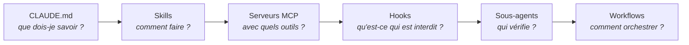

<div align="center">

# Projet Claude

**Un environnement de développement agentique pour concevoir et livrer des sites e-commerce sur mesure avec Claude Code.**


</div>

---

## Sommaire

- [Pourquoi ce projet](#pourquoi-ce-projet)
- [Architecture](#architecture)
- [Principes](#principes)
- [Structure du dépôt](#structure-du-dépôt)
- [Prérequis](#prérequis)
- [Tests](#tests)
- [Feuille de route](#feuille-de-route)

## Pourquoi ce projet

Un agent de code IA est rapide, mais il démarre chaque session sans mémoire : il ignore
les conventions du projet, les erreurs déjà commises et les règles à ne jamais enfreindre.
Lui demander du code au coup par coup donne des résultats inégaux.

Ce dépôt prend le problème à l'envers : plutôt que d'écrire du code, on construit **le cadre
de travail de l'agent**, avec son contexte, ses procédures, ses garde-fous et ses relecteurs,
pour qu'il produise un résultat **fiable, vérifié et reproductible** d'un site client à l'autre.

## Architecture

L'environnement repose sur six briques de Claude Code, chacune répondant à un besoin précis :



| Brique | Rôle | Emplacement |
|---|---|---|
| **CLAUDE.md** | Contexte du projet chargé à chaque session : stack, conventions, règles | [`CLAUDE.md`](CLAUDE.md) |
| **Skills** | Procédures réutilisables déclenchées par `/commande` | `.claude/skills/` |
| **Serveurs MCP** | Outils externes branchés sur l'agent (navigateur, Stripe) | [`.mcp.json`](.mcp.json) |
| **Hooks** | Garde-fous exécutés automatiquement, que l'agent ne peut pas contourner | `.claude/settings.json` |
| **Sous-agents** | Spécialistes au contexte isolé (relecture, sécurité, paiement) | `.claude/agents/` |
| **Workflows** | Orchestration de plusieurs agents en parallèle | `.claude/workflows/` |

## Principes

- **Consignes courtes, documentation ciblée.** `CLAUDE.md` reste concis ; le détail vit dans `docs/`.
- **Conseiller d'abord, bloquer ensuite.** Une règle devient un hook bloquant seulement quand une consigne ne suffit pas.
- **Protéger l'irréversible.** Les garde-fous portent sur les écritures, les suppressions et les secrets, pas sur la lecture.
- **Aucune perte de données.** Toute suppression passe par la Corbeille ; les suppressions définitives sont bloquées.
- **Aucun secret versionné.** Les fichiers `.env` sont exclus de Git et inaccessibles à l'agent.
- **Stack adaptée au besoin.** Next.js, TypeScript, Tailwind et Stripe forment la base par défaut ; chaque site peut s'en écarter, avec une justification documentée.

## Structure du dépôt

```
.
├── CLAUDE.md          # Contexte chargé par Claude Code à chaque session
├── README.md
├── .claude/           # Outillage agentique (réglages, skills, hooks, agents)
├── .mcp.json          # Serveurs MCP du projet (navigateur)
├── docs/              # Documentation détaillée, un fichier par sujet
├── tests/             # Tests de l'outillage : hooks et config MCP (automatisés), sous-agents (banc d'essai)
└── sites/             # Sites : démos publiques ; sites clients exclus (dépôts privés)
```

## Prérequis

| Outil | Version | Usage |
|---|---|---|
| [Claude Code](https://claude.com/claude-code) | 2.x | Agent de développement |
| [Node.js](https://nodejs.org) | ≥ 20 | Exécution des sites Next.js |
| [Git](https://git-scm.com) + [GitHub CLI](https://cli.github.com) | — | Versionnement et publication |

## Tests

Les garde-fous sont eux-mêmes testés : 174 tests automatisés, sans dépendance à installer.

```bash
node --test "tests/**/*.test.mjs"
```

Chaque suite a été validée par sabotage : un hook volontairement cassé, ou un réglage de sécurité retiré, doit faire échouer ses tests.

Le relecteur sécurité est évalué sur un banc d'essai de trois boutiques (15 failles classiques, 11 failles
subtiles avec tentatives de manipulation, une version saine), à l'aveugle, sur plusieurs passages, et validé
par sabotage : un modèle plus petit échoue ([procédure et résultats](docs/sous-agents.md#banc-dessai)).

## Feuille de route

| # | Étape | Statut |
|---|---|---|
| 0 | Mise en place : Git, GitHub CLI, exclusion des secrets | ✅ |
| 1 | Contexte agent : `CLAUDE.md` | ✅ |
| 2 | Premier hook non bloquant : notifications sonores ([doc](docs/hooks.md)) | ✅ |
| 3 | Skills ([doc](docs/skills.md)) : `/verifier` ✅ · `/nouveau-site` ✅ · `/livrer` | 🚧 |
| 4 | Hooks bloquants ([doc](docs/hooks.md)) : protection des secrets, suppressions, vérification avant fin de tâche · 120 tests | ✅ |
| 5 | Sous-agents ([doc](docs/sous-agents.md)) : relecteur sécurité et paiement · banc d'essai 15/15 et 11/11, 0 faux positif grave | ✅ |
| 6 | Serveurs MCP ([doc](docs/mcp.md)) : navigateur Playwright (2 failles trouvées et fermées) · Stripe en mode test uniquement (OAuth, sans clé) | ✅ |
| 7 | Workflow : audit multi-agents avant livraison | ⏳ |
| 8 | Premier site e-commerce réalisé avec l'environnement complet | ⏳ |

---

<div align="center">
<sub>Conçu avec <a href="https://claude.com/claude-code">Claude Code</a>.</sub>
</div>
